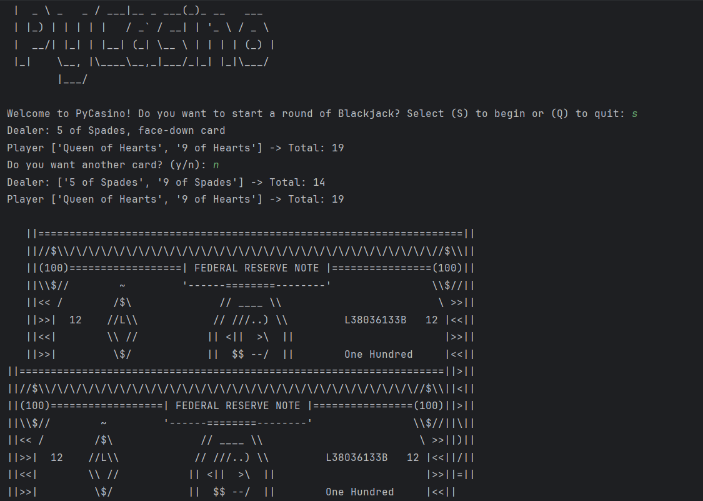

```
 ____         ____          _             
|  _ \ _   _ / ___|__ _ ___(_)_ __   ___  
| |_) | | | | |   / _` / __| | '_ \ / _ \ 
|  __/| |_| | |__| (_| \__ \ | | | | (_) |
|_|    \__, |\____\__,_|___/_|_| |_|\___/ 
       |___/                 
```

-----

## About the Game

This is a simple console-based Blackjack game developed using **Python**.

-----

## Technical Highlights and Design Choices

### Core Game Loop & Control Flow

The game logic adheres to standard Blackjack rules:

  * **Numbered Cards (2-10):** Worth their face value (e.g., a 7 is 7 points).
  * **Face Cards (Jack, Queen, King):** Each is worth 10 points.
  * **Ace:** Can be worth either 1 or 11 points, whichever benefits your hand most without exceeding 21.

I use Python's built-in `random` library to draw cards. The implementation ensures there are no duplicate cards, simulating a real deck.

```python
def shuffle_cards(deck, amount):
    random_cards = []
    for card in range(amount):
        random_card = random.choice(deck)
        random_cards.append(random_card)
    return random_cards
```

After each draw, the player can see their total points and one of the dealer's cards. This code snippet demonstrates how I implemented the rules. Since an Ace can be worth 1 or 11, I used an `if` statement to determine its value. The cards are stored as strings in my list, which is why I use `.split()` to extract their actual values.

```python
def count_cards(users_list):
    card_values = []
    total = 0
    for card in users_list:
        split_cards = card.split()
        card_values.append(split_cards[0])
    for values in card_values:
        check_digit = values.isdigit()
        if check_digit == True:
            total += int(values)
        elif values == "Ace" and total +11 <=21:
            total +=11
        elif values == "Ace" and total +11 >21:
            total +=1
        else:
            total +=10
    return total
```

-----

## Key Features

  * **User-Friendly Interface:** The game provides instant feedback regarding total card value and displays one of the dealer's cards.

-----

## Resources Used

  * **Money Art:** The various stages of the Hangman ASCII art are sourced from [ascii.co.uk](https://ascii.co.uk/art/money).
  * **Title Design:** The ASCII art for the game's title was created using [this generator](https://budavariam.github.io/asciiart-text/).

-----

