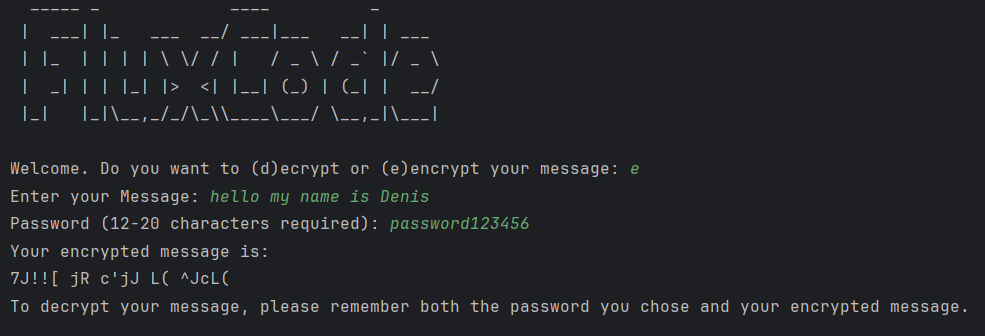
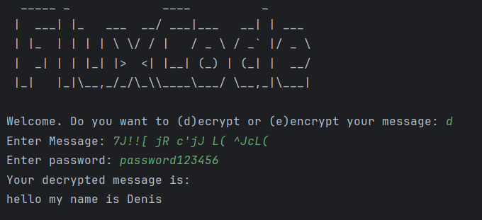

```
  _____ _             ____          _      
 |  ___| |_   ___  __/ ___|___   __| | ___ 
 | |_  | | | | \ \/ / |   / _ \ / _` |/ _ \
 |  _| | | |_| |>  <| |__| (_) | (_| |  __/
 |_|   |_|\__,_/_/\_\\____\___/ \__,_|\___|    
```

**FluxCode** is a Python-based encryption tool that uses seeded, dynamic alphabets. This is my first crypto project (for learning, NOT for production use).

-----

### About FluxCode

FluxCode is my vision of a modern Caesar Cipher with a focus on stronger encryption.

**Technologies Used:** Python

My main goal for FluxCode was **encryption**. I aimed to develop a solution that doesn't rely on fixed shift numbers, but instead uses entirely new character lists.
So, I came up with the idea of using Python's `random` module, which generates pseudo-random sequences. This allowed me to use the user's password as a seed to generate the same "random" list consistently.
By setting the password length requirement to a minimum of 12 and a maximum of 20 characters, I ensured a reasonably long seed.

Here's a snippet of the core logic I used to create a new list each time:

```python
def password_seed(allchars, user_password: str):
    random.seed(user_password)
    new_list = random.sample(allchars, len(allchars))
    return new_list
```

This function takes the `allchars` list (which contains uppercase letters, lowercase letters, symbols, and numbers) and randomizes its order using the provided seed (the user's password).

-----

Key features and design choices:

  * **Password Length:** Passwords are required to be of a certain length to ensure a robust seed.
  * **Randomness Algorithm:** The core of FluxCode uses pseudo-random generation to create millions of possible character lists.
  * **Title Design:** The ASCII art for the title was created using [this generator](https://budavariam.github.io/asciiart-text/).

Encryption:


Decryption: 
