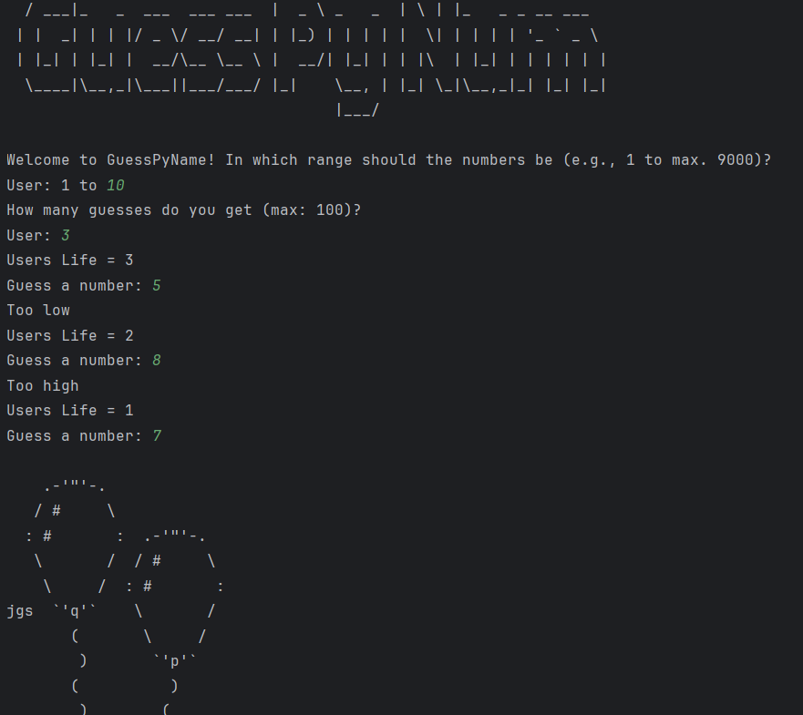

```
   ____                       ____          _   _                 
  / ___|_   _  ___  ___ ___  |  _ \ _   _  | \ | |_   _ _ __ ___  
 | |  _| | | |/ _ \/ __/ __| | |_) | | | | |  \| | | | | '_ ` _ \ 
 | |_| | |_| |  __/\__ \__ \ |  __/| |_| | | |\  | |_| | | | | | |
  \____|\__,_|\___||___/___/ |_|    \__, | |_| \_|\__,_|_| |_| |_|
                                    |___/                         
```
Here's a corrected and improved version of your README documentation, focusing on clarity, conciseness, and professionalism, while maintaining your original points.

-----

## About the Game

GuessPyNum is a classic number guessing game built with Python. Players aim to guess a randomly generated number within a customizable range and a set number of attempts.

-----

## Technical Highlights and Design Choices

### Core Game Logic & Input Validation

While the core game loop was straightforward, a primary focus during development was robust **user input validation**. This ensures the game handles diverse inputs gracefully.

Key validation checks include:

  * **Range and Guess Limits:** Users are guided to select a range (up to 9000) and number of guesses (up to 100) to prevent excessively large or small inputs that could degrade the experience.
  * **Data Type Validation:** The `isdigit()` method is used to confirm that all numerical inputs are valid integers, preventing crashes from non-numeric entries.

Here's a snippet demonstrating the input validation logic:

```python
user_select = input("Welcome to GuessPyName! In which range should the numbers be (e.g., 1 to max. 9000)?\nUser: 1 to ").strip()
users_life = input("How many guesses do you get (max: 100)?\nUser: ").strip()
users_life_isdigit = users_life.isdigit()
user_select_isdigit = user_select.isdigit()
if user_select_isdigit == True and users_life_isdigit == True:
    if int(users_life) <= 100 and int(users_life) > 0 and int(user_select) <= 9000 and int(user_select) > 0:
```

The random number is generated using Python's `random.randint` function.

### Customizable Difficulty

Instead of predefined difficulty levels, GuessPyNum offers players the **freedom to create their own challenges**. Users can define both the guessing range and the number of allowed attempts, providing a unique and varied gameplay experience with each play.

-----

## Key Features

  * **User-Friendly Interface:** Provides instant feedback on guesses (too high/low) and tracks remaining attempts, enhancing the player experience.
  * **Customizable Difficulty:** Allows players to set their own range and number of guesses, offering greater variety and replayability than static difficulty levels.

-----

## Resources Used

  * **ASCII Art (Celebration):** Various stages of celebration art are sourced from JGS at [ascii.co.uk](https://ascii.co.uk/art/celbrate).
  * **Title Design:** The ASCII art for the game's title was generated using [this tool](https://budavariam.github.io/asciiart-text/).

-----

