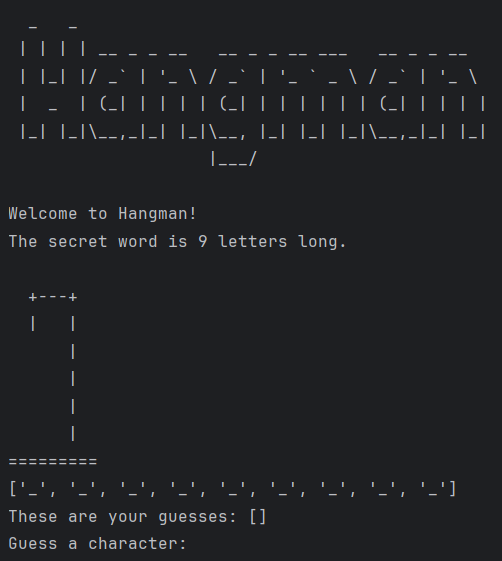

```
  _   _                                         
 | | | | __ _ _ __   __ _ _ __ ___   __ _ _ __  
 | |_| |/ _` | '_ \ / _` | '_ ` _ \ / _` | '_ \ 
 |  _  | (_| | | | | (_| | | | | | | (_| | | | |
 |_| |_|\__,_|_| |_|\__, |_| |_| |_|\__,_|_| |_|
                    |___/               
```
## About the Game

This is a simple console-based Hangman game developed using **Python**. The game challenges players to guess a secret word letter by letter before running out of attempts.

---

## Technical Highlights and Design Choices

### Core Game Loop & Control Flow

During development, I encountered a common challenge where a simple `break` statement wouldn't provide the desired control flow for exiting the main game loop from deeply nested conditions. To address this, I implemented a boolean flag, `is_game_over`, which offers a robust and clear way to manage the game's state and exit the loop from any point in the code.

Here's a snippet illustrating how player input is handled and prepared within the core game loop:

```python
while not is_game_over: # More concise and readable
    print(display_word)
    print(f"These are your guesses: {player_inputs}")
    player_guess = input("Guess a character: ").lower().strip()

    if player_guess in player_inputs:
        print("You already guessed that character.")
        continue # Allows the loop to continue for a new valid input
````

### Guessing Logic and Win Condition

If the guessed character is correct, the `display_word` is updated. The game checks if the entire word has been revealed, and if so, congratulates the player and sets `is_game_over` to `True`.

```python
if player_guess in secret_word: # Changed from word_list to secret_word for accuracy
    for i in range(len(secret_word)):
        char = secret_word[i]
        if player_guess == char:
            display_word[i] = char
            if "_" not in display_word: # Checks if all blanks are filled
                result = "".join(display_word)
                print(f"You did it, well done! The secret word was: {secret_word}")
                is_game_over = True
```

-----

## Key Features

  * **User-Friendly Interface:** The game provides immediate feedback to the user on their guesses, making the experience intuitive and engaging.
  * **Dynamic Word Generation:** Integrates with an external API to fetch random words, ensuring a fresh gameplay experience with minimal chance of repetition.
  * **Distinctive Title Design:** The game features custom ASCII art for its title, adding a unique visual touch.

-----

## APIs and Resources Used

  * **Word Source:** Words are dynamically generated via the [Random Word API](https://random-word-api.herokuapp.com).
  * **Hangman Art:** The various stages of the Hangman ASCII art are sourced from [this Gist by chrishorton](https://gist.github.com/chrishorton/8510732aa9a80a03c829b09f12e20d9c).
  * **Title Design:** The ASCII art for the game's title was created using [this generator](https://budavariam.github.io/asciiart-text/).

-----

