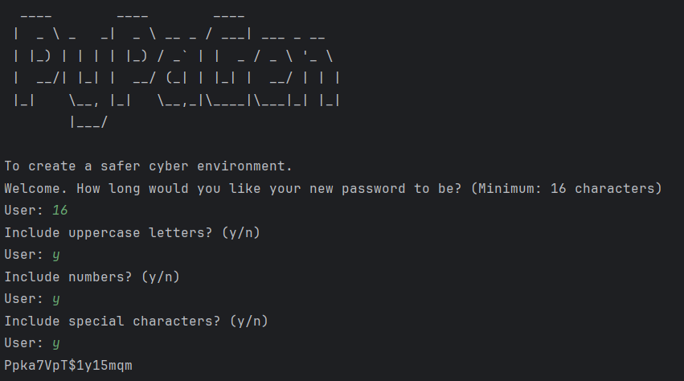

```
 ____         ____         ____
|  _ \ _   _|  _ \ __ _ / ___| ___ _ __
| |_) | | | | |_) / _` | |  _ / _ \ '_ \
| __/| |_| | __/ (_| | |_| | __/ | | |
|_|   \__, |_|   \__,_|\____|\___|_| |_|
      |___/
```

**PyPaGen** is a Python-based password generator designed for creating strong, random, and secure passwords.

-----

### About PyPaGen

PyPaGen is built with a strong focus on generating robust passwords, taking into account recommendations often found in security guidelines like **NIS2**.

**Technologies Used:** Python

My main goal for PyPaGen was **randomness**. I wanted to create the most random passwords possible, without any recognizable patterns. To achieve this, I intentionally removed the option for users to explicitly set the exact count of numbers, uppercase letters, or special characters. Instead, I aimed for a truly random distribution.

Here's a snippet of the core logic I used to distribute character types:

```python
def get_length(user_input, name_count):
    random_num = random.randint(0, user_input - 1)
    try:
        result = user_input // random_num
    except ZeroDivisionError:
        return 1
    return name_count + result
```

This function takes the desired password length and uses a division by a random number (always one less than the password length) to determine the count of certain character types. To guarantee that at least one of each chosen character type is always included, I implemented a `try-except` block to catch `ZeroDivisionErrors`.

Then, based on these calculated counts, I used a simple function to add random characters from their respective pools:

```python
def get_random(name_count, character):
    for i in range(1, name_count + 1):
        random_chars = random.choice(character)
        password_list.append(random_chars)
```

Finally, to truly mix everything up and ensure the most random password I could create, I used `random.shuffle` on the final list of characters.

-----
Key features and design choices:

* **Password Length:** Passwords are capped at **16 characters**, exceeding the minimum recommendations of standards like NIS2.
* **Character Sets:** Users can choose to include **numbers, uppercase letters, and symbols**. The generator ensures a truly random distribution of these character types, rather than allowing users to specify the exact count of each. This approach aims to enhance the randomness and unpredictability of the generated passwords.
* **Randomness Algorithm:** The core of PyPaGen uses a unique, random mathematical solution to create password patterns, aiming for genuine randomness in each output.
* **Title Design:** The ASCII art for the title was created using [this generator](https://budavariam.github.io/asciiart-text/).


-----
